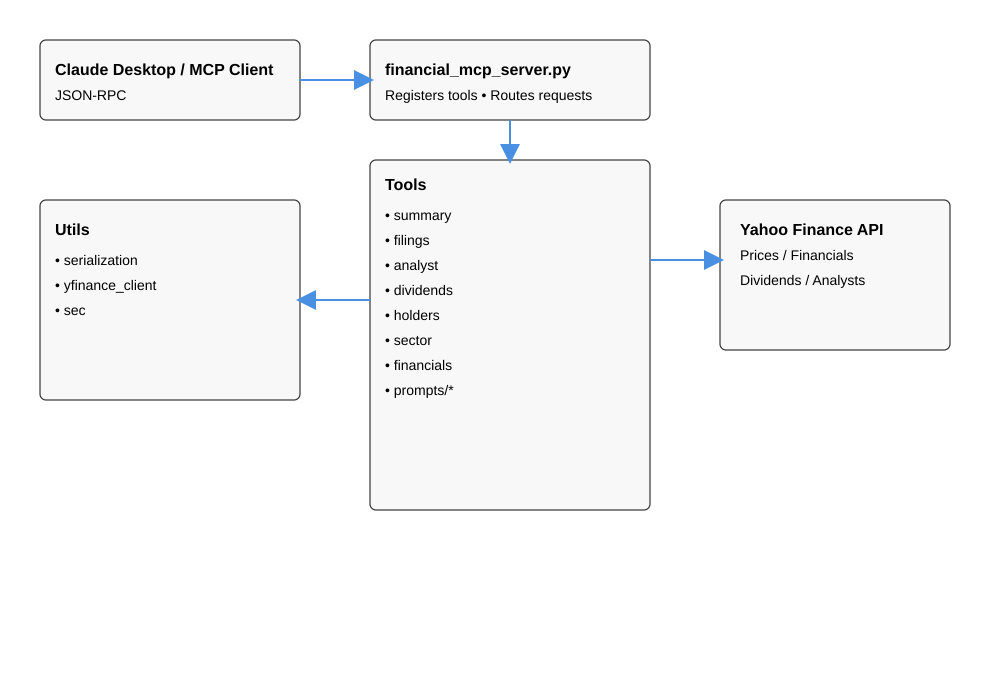

# financeCopilot

This is a playground for quantitative research workflows powered by Model Context Protocol (MCP) servers. It ships with:

- **`financial_mcp_server.py`** – a modular research assistant that wraps Yahoo Finance, SEC data and analyst intel.
- **`finance_server.py`** – the earlier QuantAssistant with classic TA tools (SMAs, returns, RSI, trade recos).

Credits for the original inspiration: [Syed Hasan’s MCP walkthrough](https://medium.com/@syed_hasan/step-by-step-guide-building-an-mcp-server-using-python-sdk-alphavantage-claude-ai-7a2bfb0c3096).

---

## Architecture



- `financial_mcp_server.py` is the only executable entry point. It loads environment variables, instantiates `FastMCP`, and registers every tool/prompt module via a `register(mcp)` hook.
- Each module under `tools/` keeps a single responsibility (summary, filings, analyst intel, etc.) and relies on shared helpers in `utils/`.
- Prompt templates such as `prompts/investment.py` remain isolated so they can be versioned separately or swapped at runtime.
- Legacy `finance_server.py` plus the TA modules (`tools/moving_average.py`, `tools/returns.py`, etc.) continue to power the QuantAssistant server; both MCP servers can run in parallel.

---

## What’s in the Financial MCP server?

| Module | Tool(s) | Description |
| --- | --- | --- |
| `tools/summary.py` | `get_stock_summary` | 5-day Yahoo Finance snapshot (price, volume, date). |
| `tools/analyst.py` | `get_analyst_targets`, `get_recommendations` | Analyst price targets and recommendation history. |
| `tools/dividends.py` | `get_dividends`, `get_splits` | Dividend and split history as simple dicts. |
| `tools/holders.py` | `get_institutional_holders`, `get_insider_transactions` | Institutional positions and insider trade logs. |
| `tools/sector.py` | `get_sector_info` | Sector & industry metadata. |
| `tools/financials.py` | `get_financial_statements` | Balance sheet, income statement, cashflow (nested dicts). |
| `prompts/investment.py` | `prompt_investment_thesis` | Ready-made user prompt for holistic theses. |


---

## Local setup (uv MCP → Claude Desktop)

### Prerequisites

- **Python 3.11+** (required by `pyproject.toml`)
- **uv** (Python package manager)

### Step 1: Install uv

Install `uv` using pip:

```bash
pip install uv
```

**Finding uv's location:**

After installation, find where `uv` is installed:

- **Windows (PowerShell):**
  ```powershell
  (Get-Command uv).Source
  ```
  Common locations: `C:\Users\<YourUsername>\.local\bin\uv.EXE` or `C:\Users\<YourUsername>\AppData\Local\Programs\Python\Python311\Scripts\uv.exe`

- **macOS/Linux:**
  ```bash
  which uv
  ```
  Common locations: `~/.local/bin/uv` or `/usr/local/bin/uv`

**Note:** If `uv` is not in your PATH, you may need to add it:
- Windows: Add the directory containing `uv.EXE` to your system PATH
- macOS/Linux: Add `~/.local/bin` to your PATH in `~/.bashrc` or `~/.zshrc`

### Step 2: Clone and install dependencies

```bash
git clone -b dev https://github.com/vallipichappan/financeCopilot.git
cd financeCopilot
uv sync
```

The `uv sync` command automatically reads `pyproject.toml` and installs all base dependencies:
- `mcp[cli]` - Model Context Protocol CLI
- `yfinance` - Yahoo Finance API client
- `httpx` - HTTP client library
- `python-dateutil` - Date utilities

**Note:** Additional runtime dependencies (pandas, requests, python-dotenv, etc.) are specified in the server files and will be installed automatically when the servers run via `uv run --with`.

### Step 3: Configure Claude Desktop

1. **Locate Claude Desktop config file:**
   - **Windows:** `%APPDATA%\Claude\claude_desktop_config.json`
   - **macOS:** `~/Library/Application Support/Claude/claude_desktop_config.json`
   - **Linux:** `~/.config/Claude/claude_desktop_config.json`

2. **Edit the config file** and add both MCP servers. Replace the placeholders:
   - `<PATH_TO_UV>` - Use the path you found in Step 1 (e.g., `C:\Users\YourUsername\.local\bin\uv.EXE` on Windows)
   - `<PATH_TO_REPO>` - Full path to your cloned repository (e.g., `C:\Users\YourUsername\financeCopilot` on Windows)

```json
{
  "mcpServers": {
    "FinancialResearchServer": {
      "command": "<PATH_TO_UV>",
      "args": [
        "run",
        "--with", "mcp[cli]",
        "--with", "pandas",
        "--with", "requests",
        "--with", "yfinance",
        "--with", "python-dotenv",
        "mcp",
        "run",
        "<PATH_TO_REPO>\\financial_mcp_server.py"
      ]
    },
    "QuantAssistant": {
      "command": "<PATH_TO_UV>",
      "args": [
        "run",
        "--with", "mcp[cli]",
        "--with", "pandas",
        "--with", "requests",
        "--with", "tabulate",
        "--with", "yfinance",
        "mcp",
        "run",
        "<PATH_TO_REPO>\\finance_server.py"
      ]
    }
  }
}
```

**Important notes:**
- Use forward slashes `/` on macOS/Linux, or double backslashes `\\` on Windows for paths
- The `--with` flags ensure additional dependencies are available at runtime (these complement `pyproject.toml`)

3. **Restart Claude Desktop** to load the new configuration.

4. **Verify setup:** After restarting, you should see "FinancialResearchServer" and "QuantAssistant" in Claude Desktop's MCP panel. Enable the tools you want to use in chat.


---

## Roadmap / ideas
- Instead of using claude desktop, it could be integrated with langchain for memory and conversation capabilities + web search api + llm connect
- App Development has to follow proper 3 tier structure 
- Swap Claude out with finbert
- More technical indicators & signal generation.
- Portfolio and risk analytics blocks.
- Natural-language query hub with RAG over filings.
- Visualisation stories (intraday dashboards, thematics).

---

## Output Links

- [Tesla vs Ford P/E](https://claude.ai/share/9e5fac93-b9b8-4455-b83e-50a5508fb41a)
- [Microsoft earnings report analysis](https://claude.ai/share/0193e817-540a-4cc6-8d54-caf4df29fc92)
- [Semiconductor sector info](https://claude.ai/share/e0a6d949-b817-411a-ae37-cf1fd557f2d0)
- [Tempus AI Risk Assessment](https://claude.ai/share/09ae70d4-2da9-400d-aa50-d8ff7f20f3b0)
- [FAANG PE Rations](https://claude.ai/share/26296bc7-c906-42ef-a165-a705f70bc6db)
